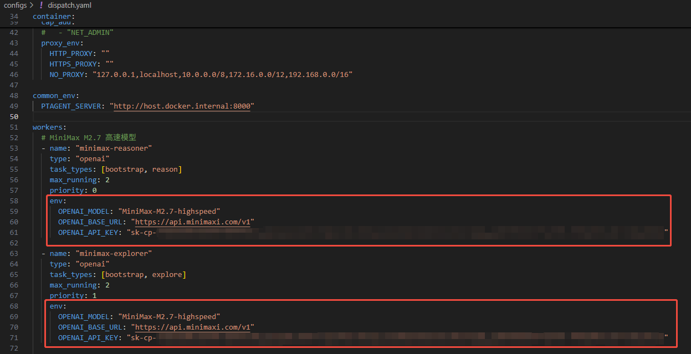
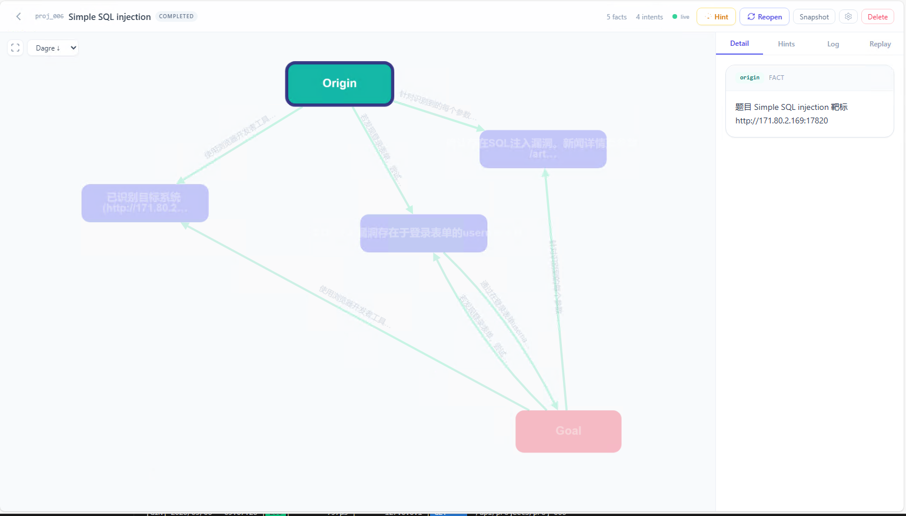
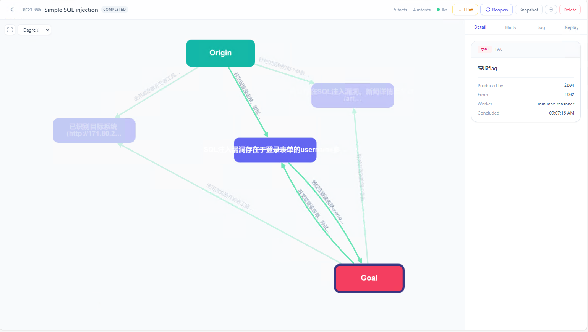
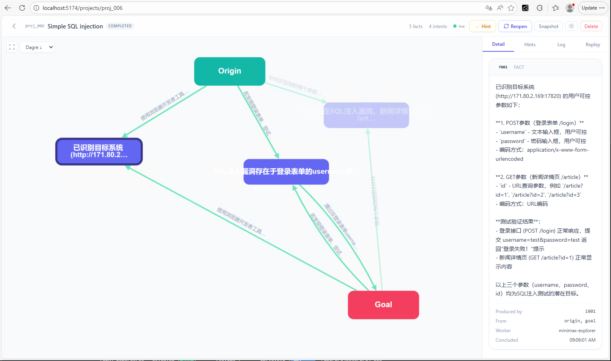
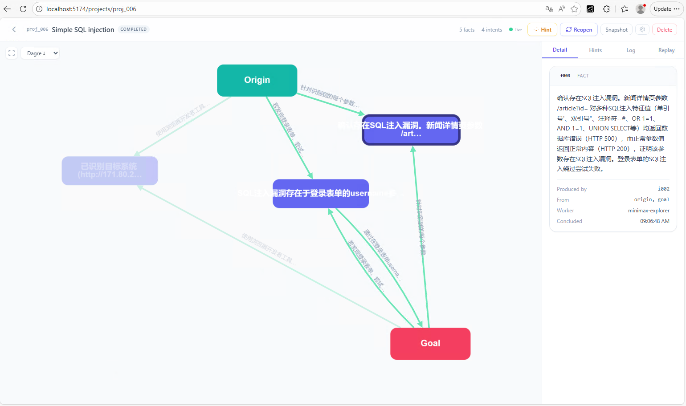
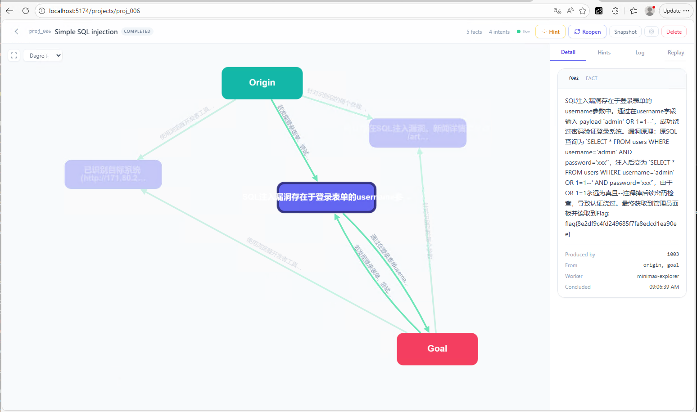
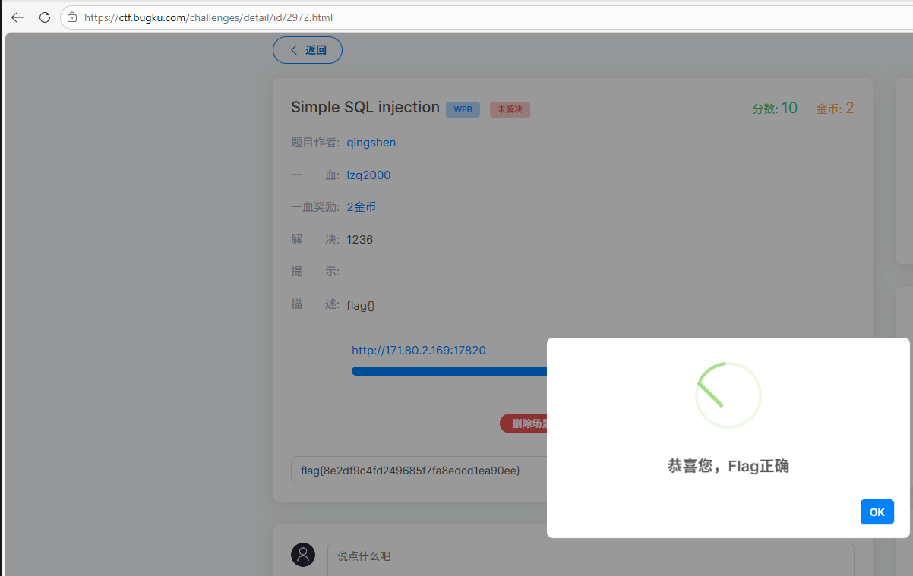

# PTAgent

PTAgent 是一个基于 Docker 的自动化渗透测试代理系统。

## 快速开始

### 1. 配置系统

首次使用时，需要进行系统配置。配置文件位于 `configs/dispatch.yaml`：



### 2. 启动服务

使用 Docker Compose 启动所有服务：

```bash
docker compose up -d
```

服务启动后，访问 http://localhost:8000 进入 Web 界面。

### 3. 新建项目

点击新建项目，填写以下信息：

- **项目名称**：为你的渗透测试项目指定一个名称
- **Origin**：已知的初始信息或起点
- **Goal**：最终目标

### 4. 查看结果
| 初始状态 | 目标状态 |
|----------|----------|
|  |  |

任务执行过程中，会自动生成进度图像：





### 5. 完成状态

最终结果展示：



## 服务架构

- **server**：Web 服务端，提供前端界面和 API
- **dispatcher**：任务调度器，负责分发和协调渗透测试任务
- **worker**：Kali Linux 工作容器，执行实际的渗透测试操作

## 停止服务

```bash
docker compose down
```

## License

本项目基于 MIT License 开源，详见 [LICENSE](LICENSE) 文件。

本项目参考了 [Cairn](https://github.com/oritera/Cairn) 的设计理念。
